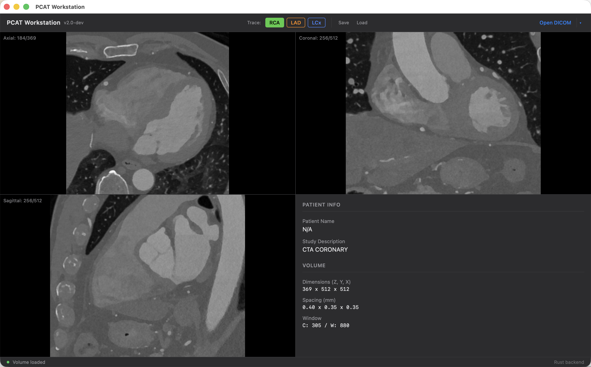
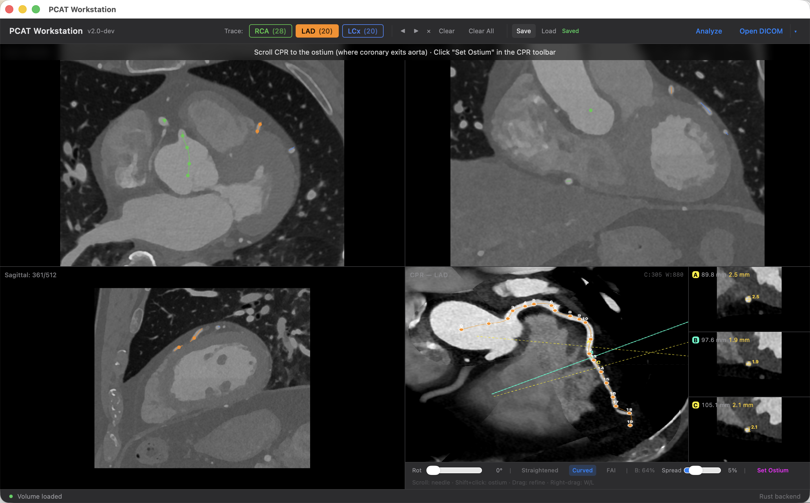
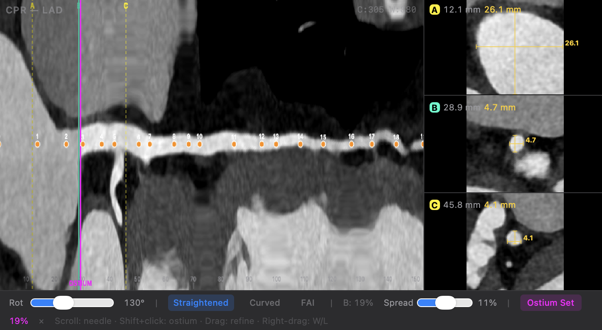
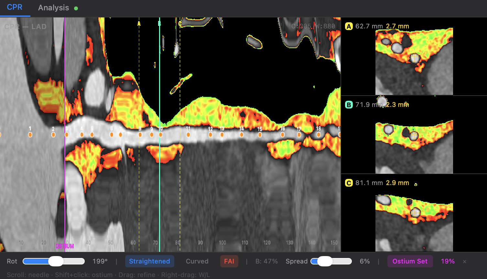
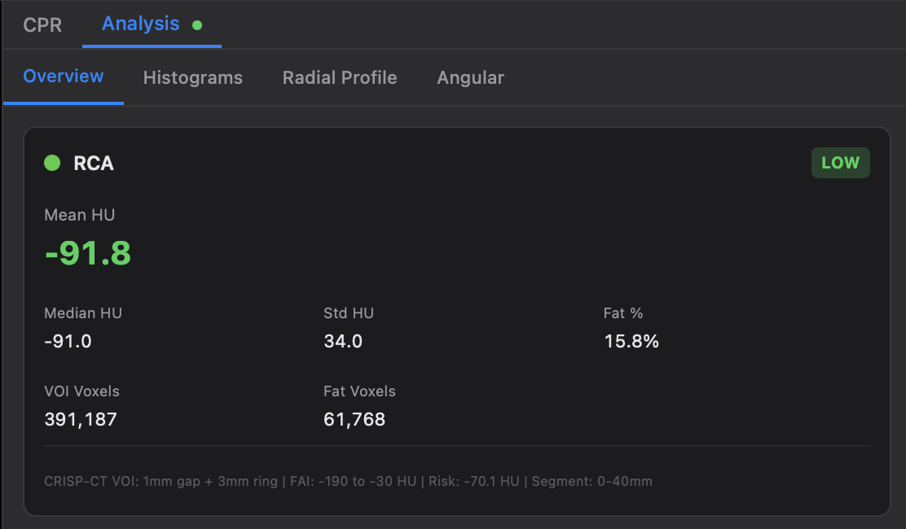
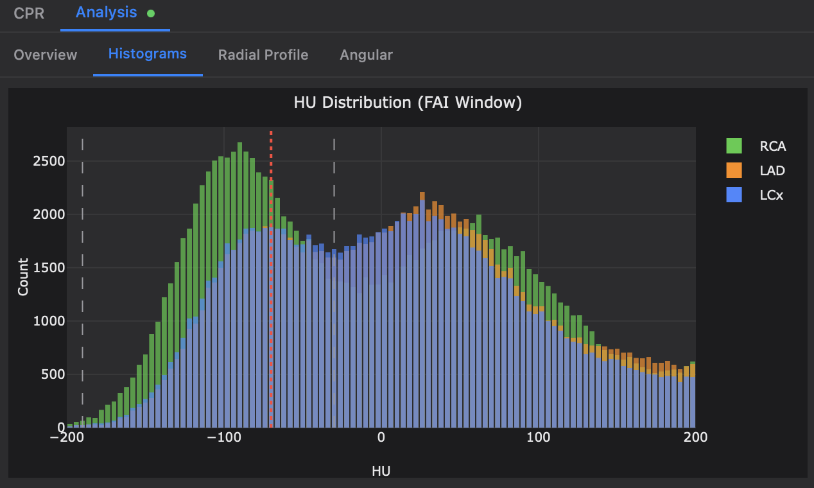
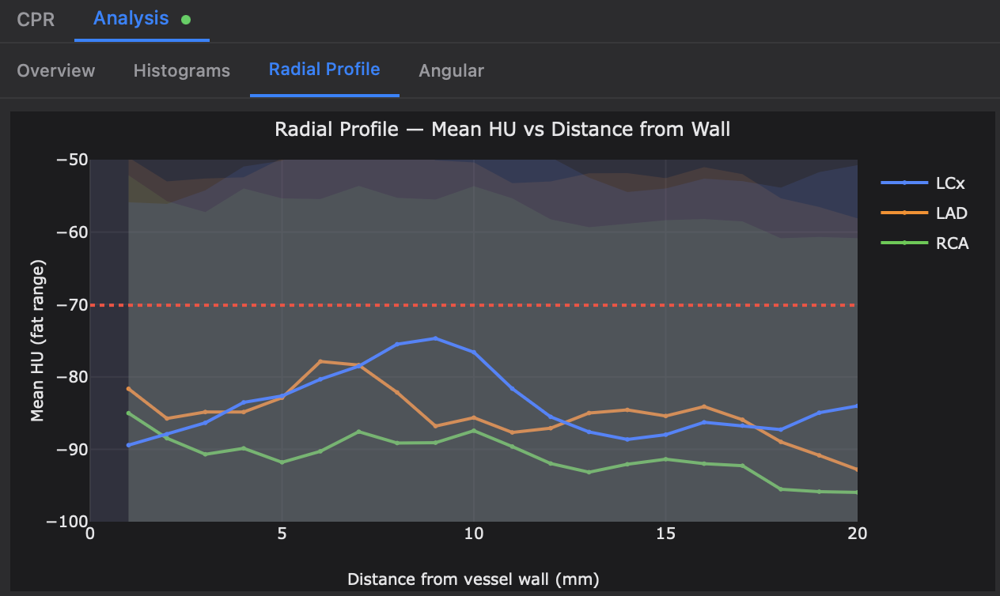
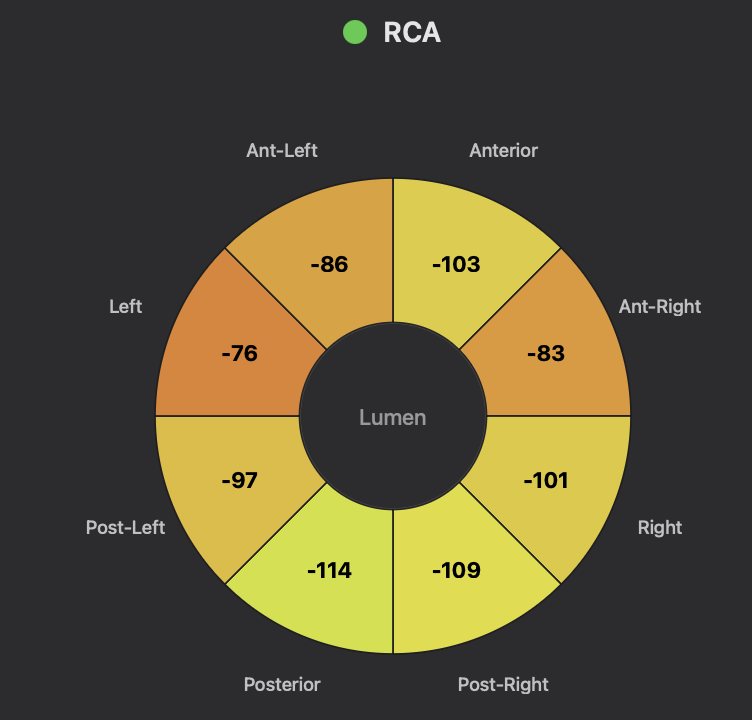
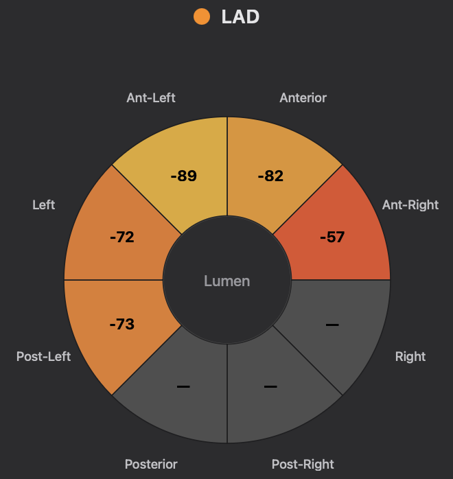

# PCAT Workstation

A desktop application for measuring **Fat Attenuation Index (FAI)** around coronary arteries from cardiac CT scans. FAI quantifies pericoronary adipose tissue inflammation — a biomarker for coronary artery disease risk.

**Author:** [Shu Nie](https://github.com/nieshuuuu) · University of California, Irvine

> **Research use only.** Not for clinical diagnosis.

---

## Quick Start

### 1. Install

Download the latest `.dmg` from [Releases](https://github.com/MolloiLab/pcat-workstation-v2/releases), open it, and drag **PCAT Workstation** to your Applications folder.

> **macOS note:** If you see "PCAT Workstation is damaged and can't be opened", open Terminal and run:
> ```
> xattr -cr /Applications/PCAT\ Workstation.app
> ```
> This removes the quarantine flag that macOS adds to unsigned downloaded apps.

### 2. Open a CT scan

Click **Open DICOM** and select the folder containing your cardiac CT DICOM files. The application loads the volume and displays it in three views: Axial, Coronal, and Sagittal.



- **Scroll** through slices with the mouse wheel
- **Adjust brightness/contrast** by right-clicking and dragging
- **Zoom** with pinch gesture on trackpad
- Recently opened scans appear in the dropdown next to "Open DICOM"

### 3. Trace the coronary arteries

Select a vessel (RCA, LAD, or LCx) from the toolbar, then **click on the MPR views** to place seed points along the artery. Start from the aorta and trace distally.



- Place at least **2 seeds** per vessel (more = smoother centerline)
- Seeds appear as colored dots; a spline centerline connects them automatically
- **Drag** a seed to adjust its position
- **Delete/Backspace** removes the selected seed
- **Cmd+Z** to undo, **Cmd+Shift+Z** to redo
- Click **Save** to store your work (auto-loads next time you open this patient)

### 4. Review the CPR

Once you have 2+ seeds, the bottom-right panel shows the **Curved Planar Reformation (CPR)** — a reformatted view that follows the vessel through the anatomy.



- Switch between **Straightened** and **Curved** modes
- **Rotate** the view with the slider at the bottom
- Three **cross-sections** (A, B, C) show the vessel at different positions
- **Shift+click** on the CPR to mark the ostium position

### 5. Run the FAI analysis

Click **Analyze** in the toolbar. The analysis takes a few seconds and includes:

1. Centerline refinement along the proximal 40mm segment
2. Vessel wall boundary detection
3. Perivascular VOI construction (CRISP-CT protocol: 1mm gap + 3mm ring)
4. FAI measurement within the -190 to -30 HU fat window

Click **FAI** on the CPR to toggle the fat attenuation overlay:
- **Green** = healthy pericoronary fat
- **Red** = inflamed pericoronary fat



### 6. View the results

After the pipeline completes, click the **Analysis** tab (next to CPR) to see:

#### Overview
Per-vessel FAI summary with risk classification (HIGH if mean HU > -70.1, LOW otherwise).



#### Histograms
HU distribution within the FAI window, with reference lines at -190, -30, and -70.1 HU.



#### Radial Profile
How mean HU changes with distance from the vessel wall (1–20mm). Shows whether inflammation is localized near the vessel or diffuse.



#### Angular Analysis
Cross-sectional ring showing mean HU in 8 sectors around the vessel. Identifies whether inflammation is focal (one side) or circumferential.




### 7. Save and compare

- Click **Save** to store seeds + analysis results together
- You can trace multiple vessels (RCA, LAD, LCx) and run the pipeline for each
- Switch between CPR and Analysis tabs anytime — your MPR views stay visible
- Click **Re-analyze** after adjusting seeds to update results

---

## Keyboard Shortcuts

| Action | Shortcut |
|--------|----------|
| Undo | Cmd + Z |
| Redo | Cmd + Shift + Z |
| Delete seed | Delete / Backspace |
| Switch vessel | 1 (RCA), 2 (LAD), 3 (LCx) |
| Navigate seeds | Left / Right arrow |
| Deselect seed | Escape |
| Set ostium | Shift + click on CPR |

---

## Analysis Parameters

| Parameter | Value | Reference |
|-----------|-------|-----------|
| FAI window | -190 to -30 HU | Antonopoulos et al., *Sci Transl Med* 2017 |
| Risk threshold | -70.1 HU | Oikonomou et al., *Eur Heart J* 2018 |
| VOI protocol | 1mm gap + 3mm ring (CRISP-CT) | CRISP-CT study |
| Segment length | Proximal 40mm from ostium | Standard clinical protocol |
| Radial profile | 1–20mm from vessel wall, 1mm bins | |
| Angular sectors | 8 sectors around vessel circumference | |

---

## For Developers

<details>
<summary>Build from source</summary>

### Prerequisites
- [Rust](https://rustup.rs/) (stable)
- [Node.js](https://nodejs.org/) >= 18
- [Tauri CLI](https://tauri.app/start/): `cargo install tauri-cli`

### Run
```bash
git clone https://github.com/MolloiLab/pcat-workstation-v2.git
cd pcat-workstation-v2
npm install
cargo tauri dev
```

### Build release
```bash
cargo tauri build
```

Output: `src-tauri/target/release/bundle/dmg/PCAT Workstation_0.1.0_aarch64.dmg`

### Tech stack
Tauri v2 (Rust) + Svelte 5 + cornerstone3D + Plotly.js

</details>

---

## References

1. Oikonomou EK et al. "Non-invasive detection of coronary inflammation using computed tomography and prediction of residual cardiovascular risk." *Eur Heart J*. 2018.
2. Antonopoulos AS et al. "Detecting human coronary inflammation by imaging perivascular fat." *Sci Transl Med*. 2017.
3. CRISP-CT: Coronary Inflammation and Structural Plaque characteristics by CT.

---

## License

MIT License. See [LICENSE](LICENSE) for details.

**Not intended for clinical diagnosis** — research use only.

*Created by [Shu Nie](https://github.com/nieshuuuu) at the [Molloi Lab](https://github.com/MolloiLab), University of California, Irvine.*

## Contact

For questions, collaboration, or issues: [Shu Nie](https://github.com/nieshuuuu) — nies1@uci.edu
